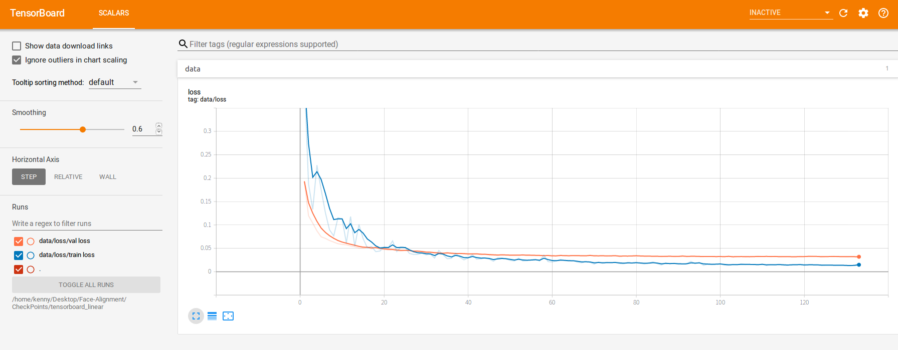
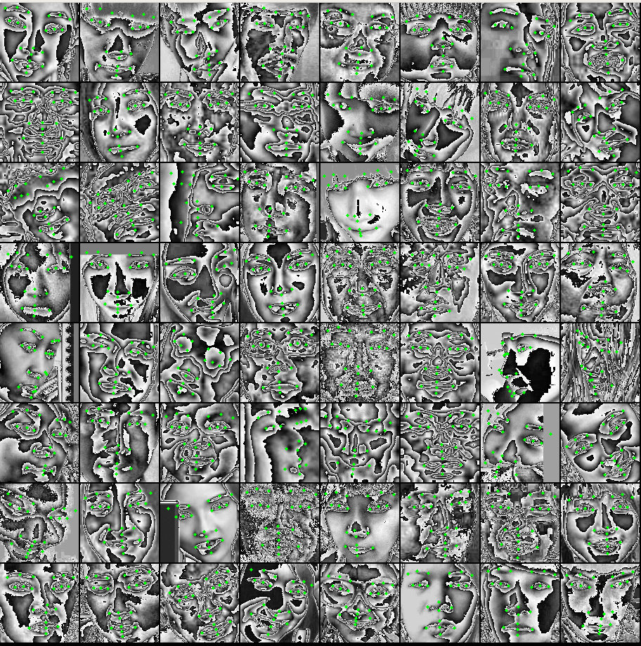
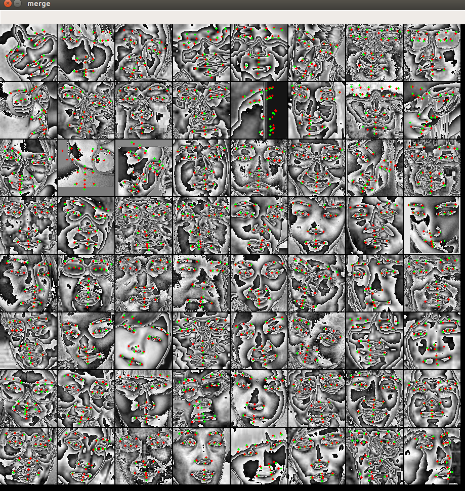
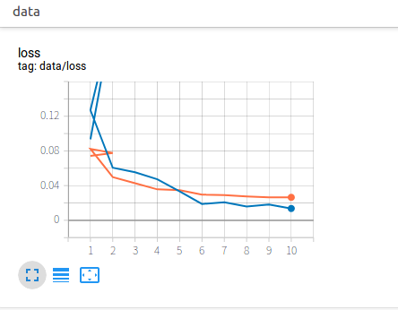
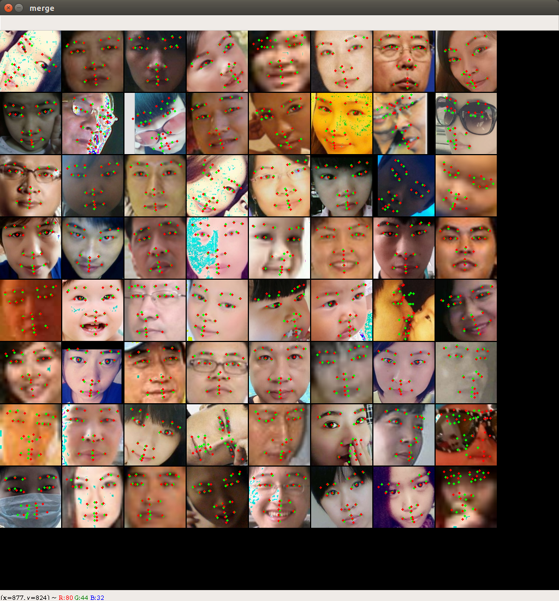
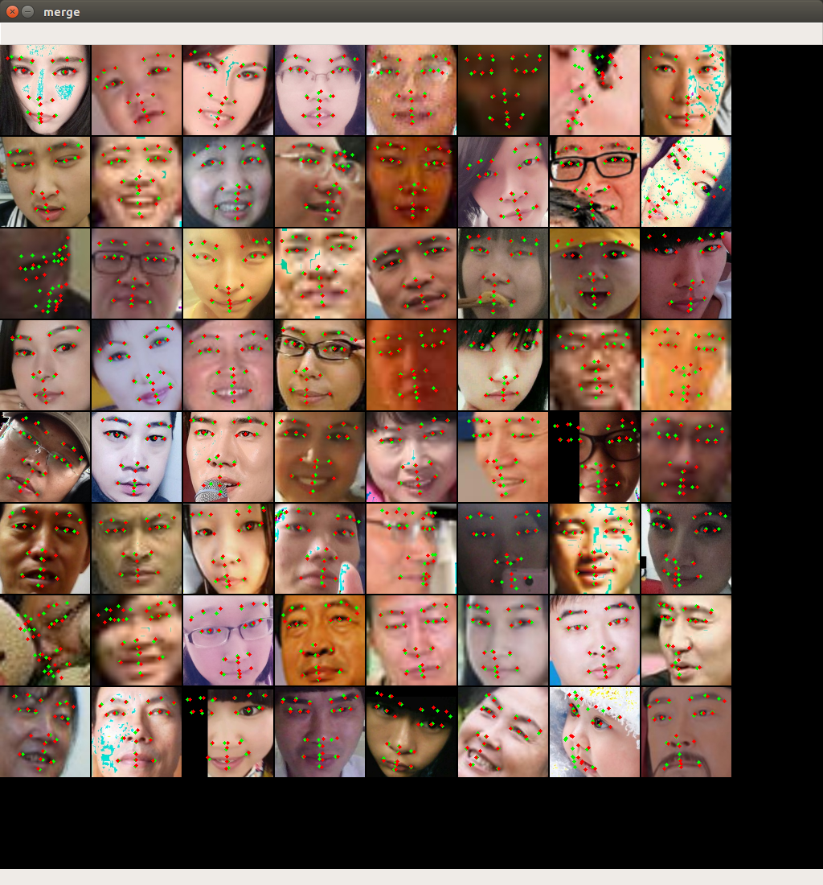
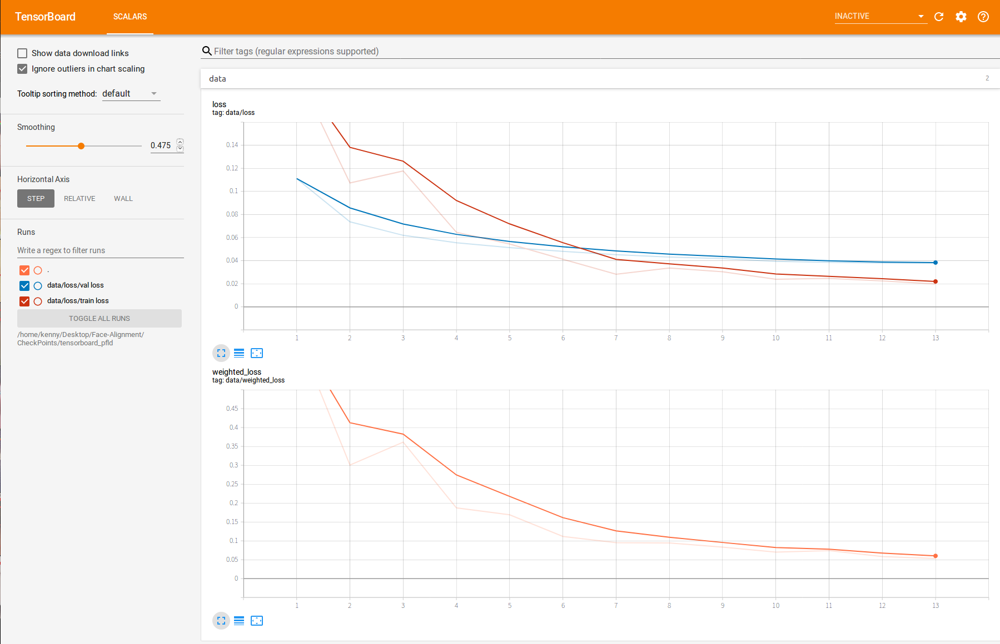
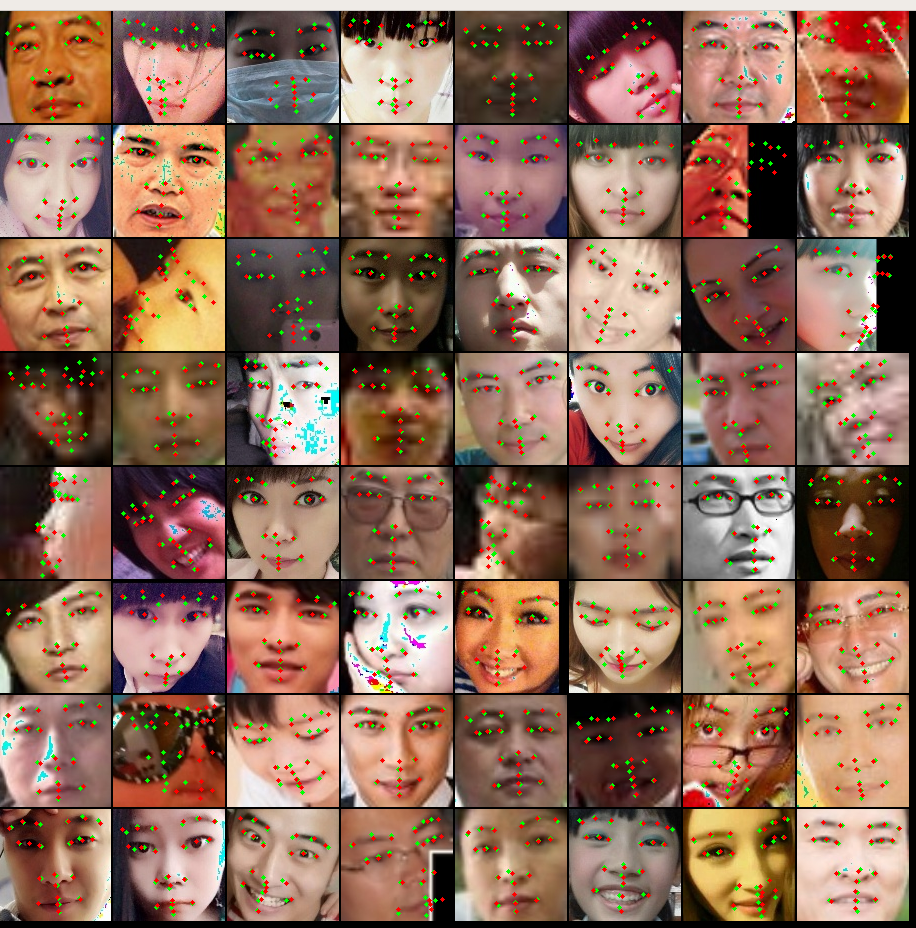

## Face Alignment

### Introduction

Using Pytorch as a framework, based on Linear model,ResNet18 or MobileNetV2
#### 1. Train Linear Model:
- Data preparation：
  - Run ` python ./Data/ODATA/linear.py `
- Training steps：
  - Run `tensorboard --logdir=/home/kenny/Desktop/Face-Alignment/CheckPoints/tensorboard_linear &`
  - Run `python Train_linear.py -h` get usage
  - Run default parms `python Train_linear.py`
  - Checkpoint `checkpoint_epoch_x.pth.tar`in`./CheckPoints/snapshot_linear/`
  - You can get training log file from `./CheckPoints/train_linear.logs`
  
- Testing steps：
  - Run `python Test_linear.py -h` get usage
  - Run default parms `python Test_linear.py`
  
#### 2. Train ResNet18 Model:
- Data preparation：
  - Run ` python ./Data/ODATA/resnet.py `
- Training steps：
  - Run `tensorboard --logdir=/home/kenny/Desktop/Face-Alignment/CheckPoints/tensorboard_resnet &`
  - Run `python Train_resnet.py -h` get usage
  - Run default parms `python Train_resnet.py`
  - Checkpoint `checkpoint_epoch_x.pth.tar`in`./CheckPoints/snapshot_resnet/`
  - You can get training log file from `./CheckPoints/train_resnet.logs`
  
- Testing steps：
  - Run `python Test_resnet.py -h` get usage
  - Run default parms `python Test_resnet.py` 
  
#### 3. Train MobileNetV2 Model(refer to PFLD):
- Data preparation：
  - Run ` python ./Data/ODATA/pfld.py `
- Training steps：
  - Run `tensorboard --logdir=/home/kenny/Desktop/Face-Alignment/CheckPoints/tensorboard_pfld &`
  - Run `python Train_pfld.py -h` get usage
  - Run default parms `python Train_pfld.py`
  - Checkpoint `checkpoint_epoch_x.pth.tar`in`./CheckPoints/snapshot_pfld/`
  - You can get training log file from `./CheckPoints/train_pfld.logs`
  
- Testing steps：
  - Run `python Test_pfld.py -h` get usage
  - Run default parms `python Test_pfld.py` 
  
### Result
#### Linear Model:
- Loss

  

- Predict

  
  
#### ResNet18:
- Loss

  

- Predict

  
  
#### MobileNetV2(refer to PFLD):
- Loss

  

- Predict

  
### Reference

- [pytorch](https://github.com/pytorch/pytorch)
- [pytorch-book](https://github.com/chenyuntc/pytorch-book)

